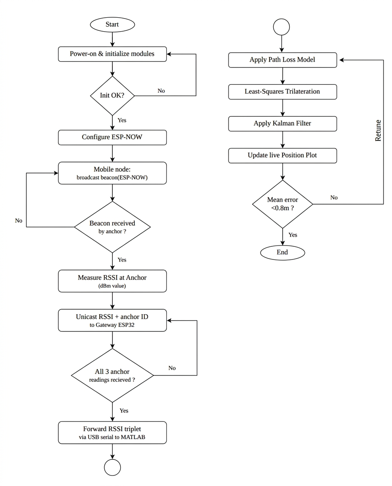
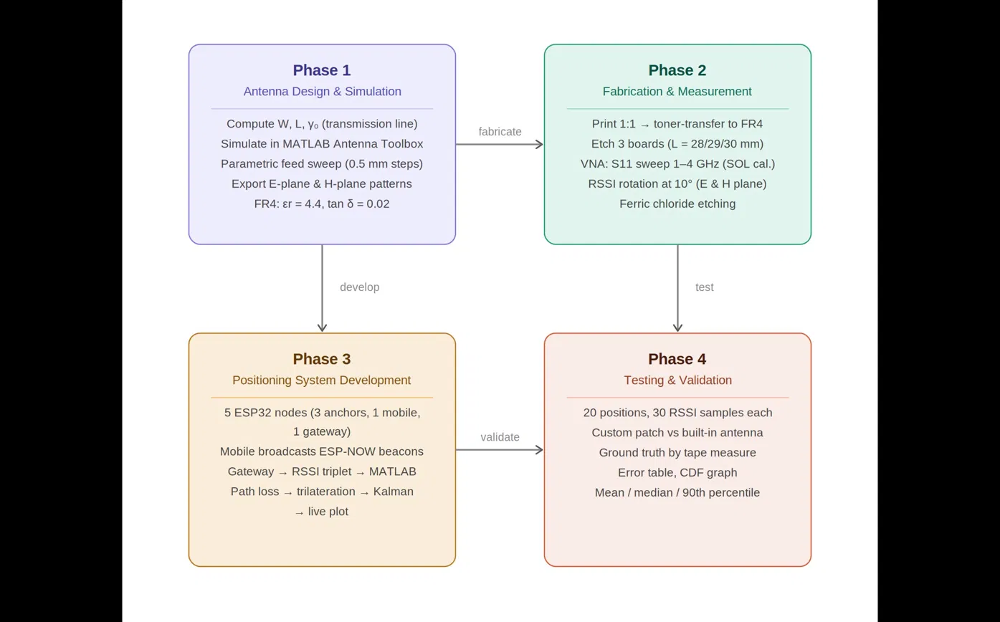

# OpenIPS: Compact 2.4 GHz Patch Antenna for RSSI-Based Indoor Localization

<p align="center">
  <strong>A custom microstrip patch antenna and ESP32-based RSSI trilateration system for indoor positioning of GPS-denied mobile nodes</strong>
</p>

<p align="center">
  
  
  
  
  
  
</p>

---

## 📖 Table of Contents

- [🎯 Overview](#-overview)
- [✨ Features](#-features)
- [🔬 Technical Specifications](#-technical-specifications)
- [🏗️ System Architecture](#️-system-architecture)
- [⚡ Installation & Setup](#-installation--setup)
- [🎮 Usage & Operation](#-usage--operation)
- [🧪 Methodology & Project Phases](#-methodology--project-phases)
- [📁 Project Structure](#-project-structure)
- [📚 Documentation & References](#-documentation--references)
- [📄 License](#-license)

---

## 🎯 Overview

**OpenIPS** is a low-cost indoor positioning system built around a custom-designed 2.4 GHz microstrip patch antenna. Unlike commercial systems that rely on generic chip antennas with unpredictable radiation patterns once mounted on a mobile chassis, OpenIPS uses an inset-fed rectangular patch antenna — impedance-matched to 50 Ω without any lumped matching components — to deliver consistent, characterized RSSI measurements for indoor trilateration.

The system targets GPS-denied environments such as collapsed structures, underground passages, and terrain-blocked zones, with disaster-response scenarios (e.g. earthquake rescue robotics) as the primary motivating use case.

A **hybrid antenna architecture** underpins the design: fixed anchor nodes use the custom directional patch antenna for a known, higher-gain radiation pattern, while the mobile rover node uses the ESP32's built-in omnidirectional antenna for RSSI stability across rotation.

> 🚧 **Development Status: In Development (Initial Phase)**. This project is under active development as part of a Institute of Engineering (IOE) minor project. Antenna dimensions have been derived via the transmission line model, and simulation is currently being validated using the Antenna Toolbox's `patchMicrostripInsetfed` object on FR4 substrate. Fabrication, hardware measurement, and full positioning system integration are upcoming phases. Code, documentation, and simulation results will be pushed regularly as the project progresses. Contributions, suggestions, and feedback are welcome!

<p align="center">
  
  <br/><sub>System architecture overview</sub>
</p>

<p align="center">
  
  
  
</p>

---

## ✨ Features

| Feature | Description |
|---------|-------------|
| 📡 Custom Patch Antenna | Inset-fed rectangular microstrip patch, 50 Ω matched with no external matching network |
| 🎯 Compact Design | Optimized for FR4 substrate (εr = 4.4, h = 1.6 mm), fabricable with locally available materials |
| 🔀 Hybrid Antenna Strategy | Directional patch on fixed anchors + omnidirectional built-in antenna on mobile rover |
| 📶 ESP-NOW Communication | Low-latency, WiFi-independent link between anchors and rover |
| 📍 RSSI Trilateration | Position estimation from three fixed anchor nodes |
| 🧮 Kalman Filtering | Smooths noisy RSSI-derived position estimates for stable tracking |
| 🚗 Rover Navigation | L298N motor driver integration for autonomous indoor movement |
| 🔬 Simulation-Validated | Electromagnetic simulation in MATLAB before physical fabrication |

---

## 🔬 Technical Specifications

### Antenna Design Parameters

<p align="center">
  
  <br/><sub>Patch antenna geometry used for the transmission-line model</sub>
</p>

| Parameter | Value | Purpose |
|-----------|-------|---------|
| Resonant Frequency | 2.4 GHz | Target operating frequency (ISM band) |
| Substrate | FR4 (εr = 4.4) | Low-cost, locally available dielectric |
| Substrate Thickness (h) | 1.6 mm | Standard FR4 board thickness |
| Patch Width (W) | ≈ 38 mm | Derived via transmission line model |
| Patch Length (L) | ≈ 29 mm | Derived via transmission line model |
| Feed Width (Wf) | ≈ 3.1 mm | Inset feedline width |
| Inset Feed Position (y₀) | ≈ 9–11 mm | Tuned for 50 Ω impedance match |
| Notch Width | Wf × 1.53 | Inset cut dimension |
| Target S11 | < −15 dB | Tightened from standard −10 dB given no-lumped-matching constraint |

### System Components

| Component | Quantity | Role |
|-----------|----------|------|
| ESP32-WROOM-32U | 4× | 3 fixed anchors (custom patch) + 1 mobile rover (built-in antenna) |
| Custom Patch Antenna | 3× | Mounted on anchor nodes via U.FL-to-SMA pigtail |
| U.FL-to-SMA Pigtail (RG-178/RG-316) | 3–4× | Connects patch antenna to ESP32 U.FL port |
| L298N Motor Driver | 1× | Drives rover motors based on trilaterated position |
| NanoVNA | 1× | Fabricated antenna impedance/S11 verification |
| FR4 Copper-Clad Board | — | Antenna fabrication substrate |

### Performance Targets

| Parameter | Specification |
|-----------|---------------|
| Target Localization Accuracy | < 1.2 m |
| Simulated Return Loss (S11) | < −15 dB at 2.4 GHz |
| Communication Protocol | ESP-NOW (anchor-to-rover), WIFI_AP_STA for simultaneous WiFi |
| Filtering | Kalman filter on trilaterated position estimates |

---

## 🏗️ System Architecture

### Core System Flow

<p align="center">
  
  <br/><sub>Core system flow from anchor nodes to rover processing and position output</sub>
</p>

### Antenna Design Flow

```
TLM Equations (W, L, y₀) → MATLAB Antenna Toolbox Simulation
    → S11 / Impedance Validation → Fabrication (FR4 etching)
    → NanoVNA Measurement → RSSI Field Comparison vs Built-in Antenna
```

### Hybrid Antenna Rationale

- **Fixed anchors** use the custom inset-fed patch antenna for a **known, repeatable, higher-gain** radiation pattern — critical since anchor positions and orientations are fixed and can be characterized once.
- **The mobile rover** uses the ESP32's **built-in omnidirectional antenna** so that RSSI readings remain stable regardless of the rover's orientation as it moves and rotates.

---

## ⚡ Installation & Setup

### Prerequisites

| Requirement | Description |
|-----------|-------------|
| MATLAB + Antenna Toolbox | Required for `patchMicrostripInsetfed` simulation |
| Arduino IDE / PlatformIO | For ESP32 firmware (anchor + rover) |
| ESP32-WROOM-32U (U.FL variant) | ×4, with U.FL antenna connectors |
| NanoVNA | For post-fabrication antenna verification |
| Fabrication Tools | FR4 copper-clad board, ferric chloride etchant, SMA connectors |

### Step-by-Step Setup

#### 1. Clone the Repository

```bash
git clone https://github.com/yourusername/OpenIPS.git
cd OpenIPS
```

#### 2. Run the Antenna Simulation (MATLAB)

```matlab
% From the /simulation directory
run patch_antenna_2400MHz.m
```

This derives base dimensions (W, L, Wf, y₀, NotchWidth) from the transmission line model and feeds them into the `patchMicrostripInsetfed` simulation.

#### 3. Flash ESP32 Firmware

```bash
# Anchor node firmware
pio run -e anchor -t upload

# Rover node firmware
pio run -e rover -t upload
```

#### 4. Hardware Assembly

- Solder SMA female connector at each patch antenna's feed point.
- Connect patch antennas to anchor ESP32 modules via U.FL-to-SMA pigtail (RG-178 or RG-316).
- Mount rover ESP32 with built-in antenna exposed, wired to the L298N motor driver.

<p align="center">
  
  <br/><sub>Vector network analyzer used for post-fabrication antenna verification</sub>
</p>

---

## 🎮 Usage & Operation

### Current Operation (Simulation Phase)

At this stage, usage is centered on running and validating the MATLAB simulation pipeline:

```matlab
% Section 1: single-point timing validation
% L = 29 mm, y0 = 9.5 mm, minimized ground plane, coarse mesh
runSimulationTest();

% Section 2 (pending Section 1 timing validation): full 5x5 parametric sweep
% runParametricSweep();
```

### Planned Operation (Post-Fabrication)

1. **Power On** — Anchor nodes broadcast via ESP-NOW; rover begins RSSI sampling.
2. **Trilateration** — Rover computes position estimate from three anchor RSSI readings.
3. **Kalman Filtering** — Smooths position estimate over time.
4. **Motor Control** — L298N driver executes navigation commands based on filtered position.

---

## 🧪 Methodology & Project Phases

| Phase | Status | Description |
|-------|--------|-------------|
| 1. Design | ✅ Complete | TLM-derived patch dimensions (W, L, y₀, Wf) |
| 2. Simulation | 🚧 In Progress | MATLAB Antenna Toolbox validation, S11 target < −15 dB |
| 3. Fabrication | ⏳ Upcoming | FR4 etching, SMA connector soldering, 3-variant fallback plan |
| 4. Measurement | ⏳ Upcoming | NanoVNA verification; RSSI fallback per Cidronali et al. methodology |
| 5. System Integration | ⏳ Upcoming | ESP-NOW anchor-rover communication, trilateration, Kalman filter |
| 6. Validation | ⏳ Upcoming | RSSI accuracy comparison: custom patch vs. built-in ESP32 antenna |

**Key design principles applied throughout:**
- Change one antenna parameter at a time during tuning to avoid impedance collapse.
- Minimize ground plane size and feed stub length, and use the coarsest acceptable mesh to keep simulation runtimes tractable.
- Validate simulation timing on a single point before scaling to a full parametric sweep.

<p align="center">
  
  <br/><sub>Project methodology and workflow</sub>
</p>

---

## 📁 Project Structure

```
OpenIPS/
│
├── simulation/                     # MATLAB Simulation Files
│   ├── patch_antenna_2400MHz.m     # TLM dimension derivation script
│   ├── section1_timing_test.m      # Single-point timing validation
│   └── section2_parametric_sweep.m # 5x5 parametric sweep (pending)
│
├── firmware/                       # ESP32 Firmware
│   ├── anchor/                     # Anchor node firmware (ESP-NOW broadcast)
│   ├── rover/                      # Rover firmware (RSSI + trilateration + motor control)
│   └── platformio.ini              # Build configuration
│
├── fabrication/                    # Antenna Fabrication Files
│   ├── gerber/                     # Etching mask / Gerber files
│   └── notes.md                    # Fabrication process notes
│
├── docs/                           # Project Documentation
│   ├── proposal/                   # Minor project proposal (TU/IOE)
│   └── references/                 # Literature review references
│
├── LICENSE                         # MIT License
└── README.md                       # This file
```

---

## 📚 Documentation & References

### Key References

| Reference | Topic |
|-----------|-------|
| C. A. Balanis, *Antenna Theory* (4th ed.) | Primary antenna design reference |
| Cidronali et al., MIKON 2019 | RSSI-based radiation pattern validation methodology |
| Almasi, 2024 | Impact of antenna orientation on RSSI accuracy |
| Sadowski & Spachos, 2018 (IEEE Access) | RSSI localization baseline |

### Institution

This project is developed as a Minor Project for the **Bachelor's degree in Electronics Engineering**, Tribhuvan University, Institute of Engineering (Pokhara).

---

## 📄 License

This project is licensed under the MIT License - see the LICENSE file for details.

```
MIT License

Copyright (c) 2026 OpenIPS Project

Permission is hereby granted, free of charge, to any person obtaining a copy
of this software and associated documentation files (the "Software"), to deal
in the Software without restriction, including without limitation the rights
to use, copy, modify, merge, publish, distribute, sublicense, and/or sell
copies of the Software, and to permit persons to whom the Software is
furnished to do so, subject to the following conditions:

The above copyright notice and this permission notice shall be included in all
copies or substantial portions of the Software.

THE SOFTWARE IS PROVIDED "AS IS", WITHOUT WARRANTY OF ANY KIND, EXPRESS OR
IMPLIED, INCLUDING BUT NOT LIMITED TO THE WARRANTIES OF MERCHANTABILITY,
FITNESS FOR A PARTICULAR PURPOSE AND NONINFRINGEMENT.
```

---

## 👨‍💻 Author

<p align="center">
  <strong>Sarpharaj Dewan</strong><br>
  💼 Embedded Systems & Robotics Enthusiast
</p>

<p align="center">
  <a href="https://www.instagram.com/sarpharaj_09/">
    
  </a>
  <a href="https://www.youtube.com/@nepotronics">
    
  </a>
  <a href="https://www.linkedin.com/in/sarpharaj-dewan/">
    
  </a>
</p>

---

## ⭐ Support the Project

If you found this project useful or interesting, please consider giving it a star!

<p align="center">
  <a href="https://github.com/yourusername/OpenIPS/stargazers">
    
  </a>
</p>

---

<p align="center">
  <i>"Finding your way, where satellites can't."</i>
</p>

<p align="center">
  <strong>Made with ❤️ by Sarpharaj Dewan</strong>
</p>